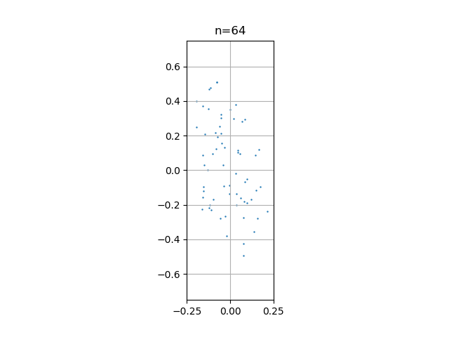
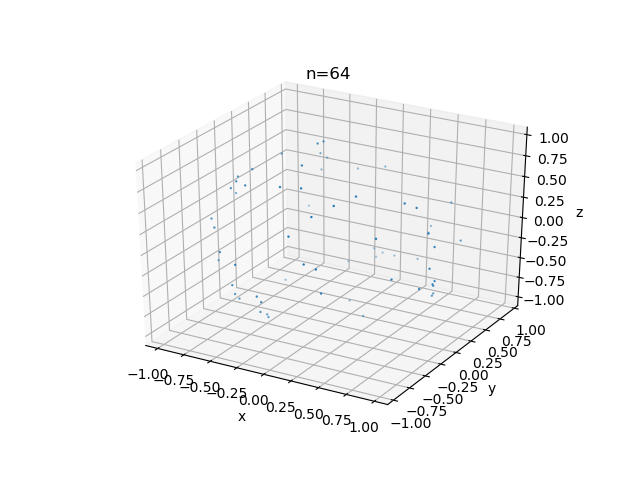
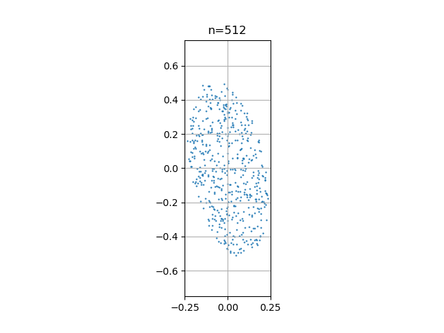
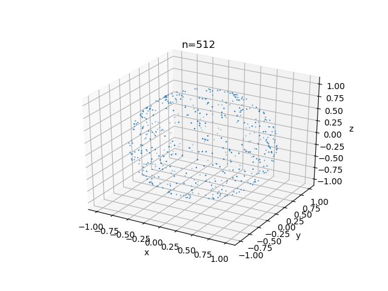
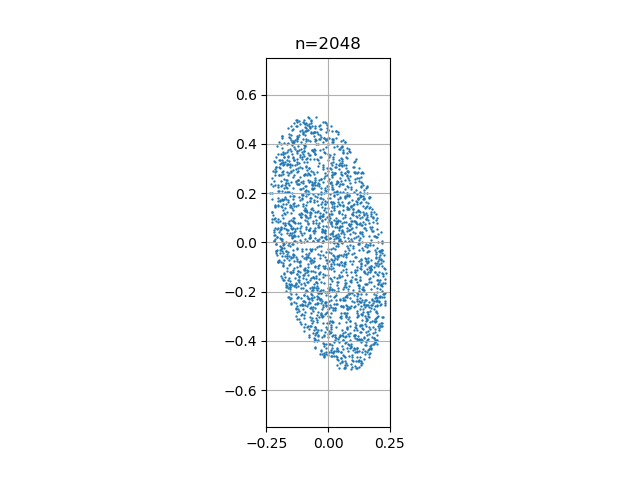
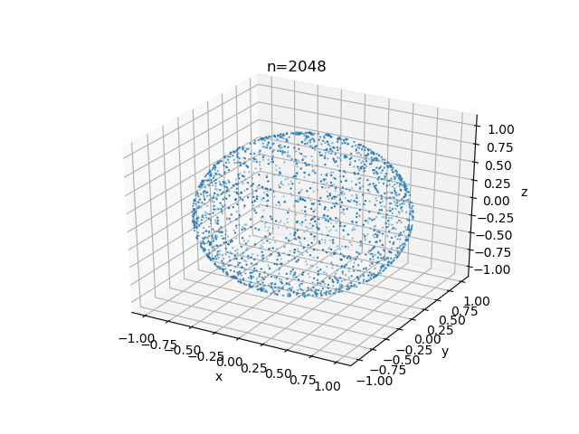
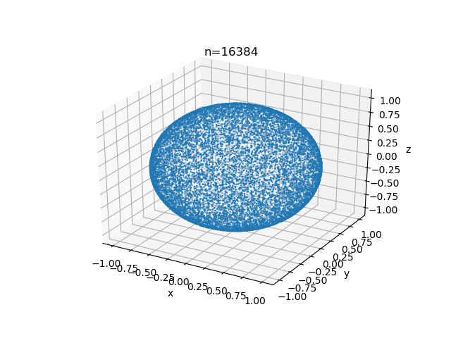
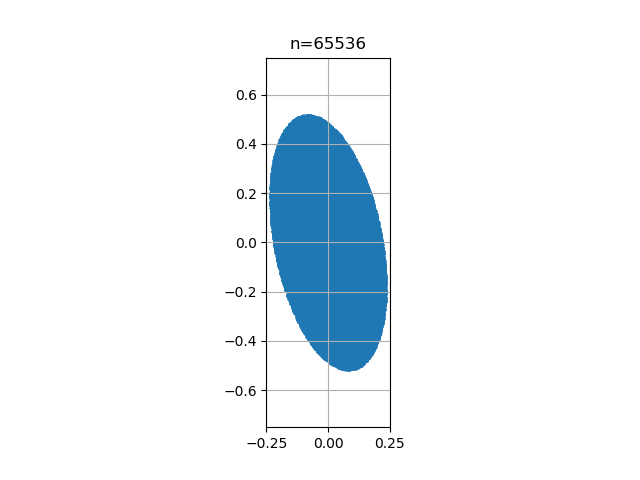
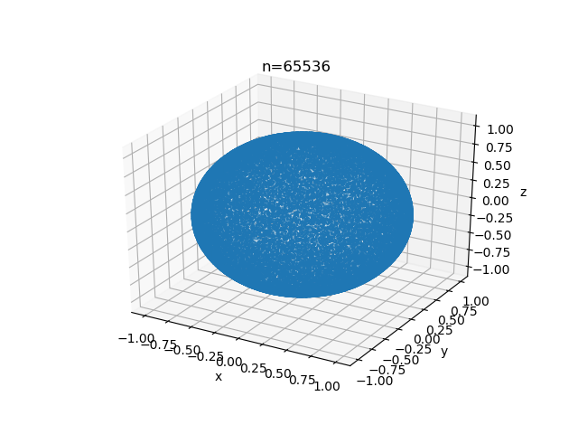

# Monte Carlo

## annulus_monte_carlo

Monte Carlo Estimate of Integrals in an Annulus

Monte Carlo method to estimate the integral of a function over the interior of a circular annulus in 2D.

A circular annulus with center (XC,YC), inner radius R1 and outer radius R2, is the set of points (X,Y) so that
$$ R_1^2 <= (x-x_c)^2 + (y-y_c)^2 <= R_2^2  $$

```Python
e = [0, 2]
value = monomial_value(2, n, e, x)
result = annulus_area(center, r1, r2) * np.sum(value[:]) / n
```

## ball_monte_carlo

Monte Carlo method to estimate integrals of a function over the interior of the unit ball in 3D

```Python
    while (n <= 65536):
        x, seed = ball01_sample(n, seed)
        for j in range(0, 7):
            e = e_test[j, :]
            value = monomial_value(3, n, e, x)
            result = ball01_volume() * np.sum(value) / float(n)
        n = 2 * n
```

mononial_value
product ( 1 <= i <= m ) x(i)^e(i)

## circle_monte_carlo

Monte Carlo method to estimate the integral of a function on the circumference of the unit circle in 2D;

## cube_monte_carlo

Monte Carlo method to estimate the integral of a function over the interior of the unit cube in 3D.

## disk01_monte_carlo

Monte Carlo method to estimate integrals over the interior of the unit disk in 2D.

## disk01_quarter_monte_carlo

Monte Carlo method to estimate the integral of a function over the interior of the unit quarter disk in 2D;

## disk_monte_carlo

Monte Carlo method to estimate integrals over the interior of a disk in 2D.

## ellipse_monte_carlo

Monte Carlo method to estimate the value of integrals over the interior of an ellipse in 2D.

$x'' * A * x <= r^2$  
$a x^2 + b xy + c y^2 = d$

A = (  a  b/2 )
    ( b/2  c  )
R = sqrt ( d )

```Python
#
#  Get the factor U such that U' * U = A.
#
u_fa = r8po_fa(2, a)
#
#  Get the points Y that satisfy Y' * Y = R * R.
#
x, seed = uniform_in_sphere01_map(2, n, seed)
x = r * x
#
#  Solve U * X = Y.
#
s = np.zeros(2)
t = np.zeros(2)

for j in range(0, n):
    t[0:2] = x[0:2, j]
    s[0:2] = r8po_sl(2, u_fa, t)
    x[0:2, j] = s[0:2]

# retun x, seed
```

Ellipse Sampling
|    n= | ellipse (2D)                               | sphere (3D)                               |
| ----: | ------------------------------------------ | ----------------------------------------- |
|    64 |  |  |
|   512 |  |  |
|  2048 |  |  |
| 16384 |  |  |
| 65536 |  |  |

```Python
import numpy as np
import matplotlib.pyplot as plt
import sys
import os
import time

sys.path.append(os.path.join('../'))
from base import plot2d

obj = plot2d()
obj.create_tempdir(-1)
seed = 123456789

print('')
txt = " \tN"
for e in e_test:
    txt += "\tX^{:d} Y^{:d}".format(*e)
print(txt)
print('')

n = 1
while (n <= 65536):
    x, seed = ellipse_sample(n, a, r, seed)
    print('  %8d' % (n), end='')

    for e in e_test:
        value = monomial_value(2, n, e, x)
        result = ellipse_area1(a, r) * np.sum(value[0:n]) / float(n)
        print('\t%14.6g' % (result), end='')
    print('')

    obj.axs.scatter(*x, s=0.5)
    obj.axs.set_title("n={:d}".format(n))
    obj.axs.set_xlim(-r * 1.25, r * 1.25)
    obj.axs.set_ylim(-r * 1.25, r * 1.25)
    obj.SavePng_Serial(obj.rootname)
    plt.close()
    obj.new_fig()

```

## ellipsoid_monte_carlo

Monte Carlo method to estimate the value of integrals over the interior of an ellipsoid in M dimensions.

## hyperball_monte_carlo

Monte Carlo method to estimate the integral of a function over the interior of the unit hyperball in M dimensions;

## hypercube_monte_carlo

Monte Carlo method to estimate the integral of a function over the interior of the unit hypercube in M dimensions.

## hypersphere_monte_carlo

Monte Carlo method to estimate the integral of a function on the surface of the unit sphere in M dimensions;

## line_monte_carlo

Monte Carlo method to estimate integrals over the length of the unit line in 1D.

## polygon_monte_carlo

Monte Carlo method to estimate the integral of a function over the interior of a polygon in 2D.

## pyramid_monte_carlo

Monte Carlo method to estimate integrals of a function over the interior of the unit pyramid in 3D;

## simplex_monte_carlo

Monte Carlo method to estimate integrals over the interior of the unit simplex in M dimensions.

## sphere_monte_carlo

Monte Carlo method to estimate integrals of a function over the surface of the unit sphere in 3D;

## square_monte_carlo

Monte Carlo method to estimate the integral of a function over the interior of the unit square in 2D.

## tetrahedron01_monte_carlo

Monte Carlo method to estimate integrals over a tetrahedron.

## triangle01_monte_carlo

Monte Carlo method to estimate integrals over the interior of the unit triangle in 2D.

## triangle_monte_carlo.py

## wedge_monte_carlo.py

Monte Carlo method to estimate integrals over the interior of the unit wedge in 3D.
