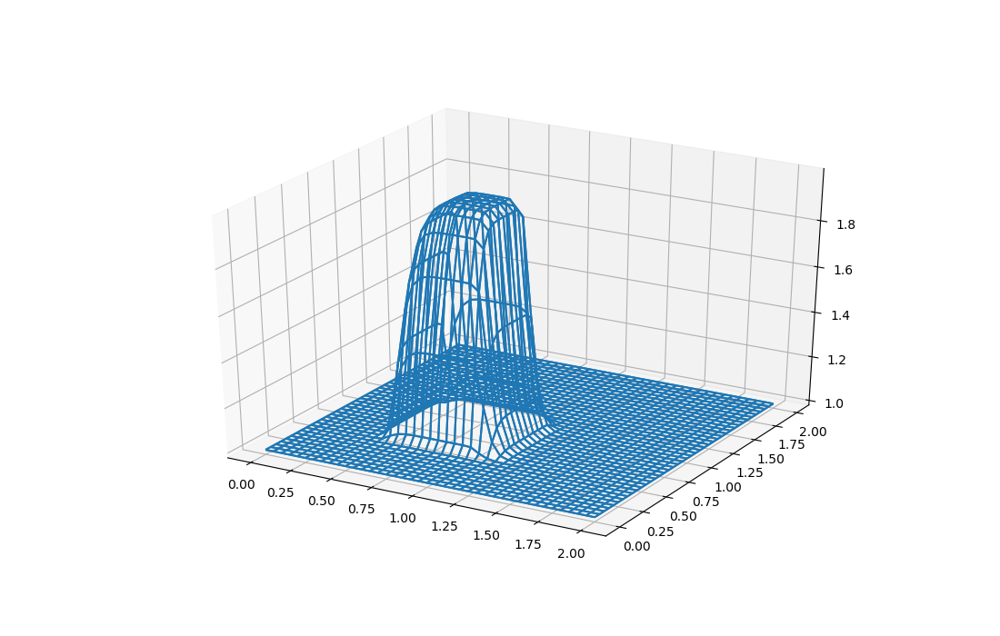

# CFD

## STEP01 1-D Linear Convection

## STEP02 1-D Nonlinear Convection

## STEP03 1-D Diffusion

## STEP04 1-D Burgers equation

## STEP05 2-D linear convection equation

|                                  |                                 |
| -------------------------------- | ------------------------------- |
|  |  |
|                                  |  |

- Discussion:
  - In the following exercises, you will extend the first four steps to 2D.
    To extend the 1D finite-difference formulas to partial derivatives in 2D
    or 3D, just apply the definition: a partial derivative with respect to x
    is the variation in the x direction at constant y.

    In 2D space, we can discretize a rectangular region by creating a
    (uniform) grid is defined by points with coordinates:
      x(i) = x0 + i dx, 0 <= i < nx
      y(j) = y0 + j dy, 0 <= j < ny
    where (x0,y0) is the location of the lower left corner of the region.

    Using this discretization of a region, we may define discretized functions
    by listing a value at every grid point (i,j).  Thus u(i,j) will be the
    value of our discretized function at the point (x(i),y(j)).

    In fact, our solution varies with time.  Therefore, we can imagine
    discretizing time, using an index n, running 0 <= n <= nt.  If we
    wish to discuss a discretized solution value, then strictly speaking
    we should include all three indices when referencing it, perhaps
    in the order n, i, j, so that we would refer to a typical entry as
    u(n,i,j).

    However, in cases where the time variable is not important, we might
    simply write u(i,j) instead.

    A differential equation in 2D may include (first order) partial derivatives.
    Such a derivative considers changes in a function of x, y and t that occur
    when only one variable is changed.  Thus, the corresponding finite
    difference approximation to a partial derivative simply compares values
    of the function along one coordinate ( t, x, or y ), using the 2D
    Taylor expansion only in that coordinate direction.

    Here, for example, is how a first order partial derivative with respect
    to x can be approximated by a forward difference in x:

      du                   ( u(n,i+1,j) - u(n,i,j)
      --(t(n),x(i),y(j)) = ----------------------- + O(dx)
      dx                                dx

    We could also use a backward or central difference for this approximation.
    A first order partial derivative with respect to y would be handled by
    a difference in the j direction.

    The 2D linear convection equation is a generalization of the 1D
    equation, and is written as

      du     ( du   du )
      -- + c ( -- + -- ) = 0
      dt     ( dx   dy )

    For our finite difference approximation, the timestep will be discretized
    as a forward difference and both spatial steps will be discretized as
    backward differences.

    With the 1D implementation, we used the i subscript to denote movement
    in the x spatial direction, as in u(n,i)-u(n,i-1).  Now that we have two
    dimensions to account for, we need to add a second subscript, j, which
    will correspond to variation in the y spatial direction, along with the
    n index for time.

    With that in mind, our discretization of the PDE should be relatively
    straightforward:

      u(n+1,i,j) - u(n,i,j)     ( u(n,i,j) - u(n,i-1,j)   u(n,i,j) - u(n,i,j-1) )
      --------------------- + c ( --------------------- + --------------------  ) = 0
                dt              (         dx                      dy            )

    As before, solve for the only unknown:

      u(n+1,i,j) = u(n,i,j) - c dt/dx ( 2 u(n,i,j) - u(n,i-1,j) - u(n,i,j-1) )

    We will solve this equation with the following initial conditions
    at t = 0.0 (or n = 0):

      u(0.0,x,y) = 2.0 if x and y are both greater than 0.5 and less than 1;
                   1.0 otherwise

    and boundary conditions, for any t greater than 0:
      u(t,x,y) = 1.0 for x=0.0 or y=0.0 or x=2.0 or y=2.0
    which is equivalent to the discrete conditions:
      u(n,i,j) = 1.0 if i = 0 or i = nx - 1 or j = 0 or j = ny - 1.

## STEP06 2-D nonlinear convection equation

|                                    |                                  |
| ---------------------------------- | -------------------------------- |
|  |  |
|  |  |

## STEP07 2-D diffusion equation

|                                  |                             |
| -------------------------------- | --------------------------- |
|  |                             |
|       |  |
|       |

## STEP08 2-D Burgers equation

|                                  |                                |
| -------------------------------- | ------------------------------ |
|  |  |

## STEP09 2-D Laplace equation

|                                  |                                |
| -------------------------------- | ------------------------------ |
|  |  |

## STEP10 2-D Poisson equation

|                                |
| ------------------------------ |
|  |

## STEP11 2-D Navier-Stokes equations for the driven cavity

|                              |                              |
| ---------------------------- | ---------------------------- |
|  |  |

    The final two steps in this interactive module teaching beginning CFD
    with Python will both solve the Navier-Stokes equations in two dimensions,
    but with different boundary conditions.

    Recall the Navier-Stokes equations for an incompressible fluid, letting
    v represent the velocity vector, and p the pressure:

      dv                      -1
      -- + ( v dot del ) v =  --- del p + nu del^2 v
      dt                      rho

      del dot v = 0

    Rewritten as a system of 3 scalar differential equations for (u,v) and p,
    we have:

      du     du     du   - 1 dp      ( d2 u   d2 u )
      -- + u -- + v -- = --- -- + nu ( ---- + ---- )
      dt     dx     dy   rho dx      ( dx2    dy2  )

      dv     dv     dv   - 1 dp      ( d2 v   d2 v )
      -- + u -- + v -- = --- -- + nu ( ---- + ---- )
      dt     dx     dy   rho dy      ( dx2    dy2  )

      d2 p   d2 p         ( du du     du dv   dv dv )
      ---- + ---- = - rho ( -- -- + 2 -- -- + -- -- )
      dx2    dy2          ( dx dx     dy dx   dy dy )

    From the previous steps, we already know how to discretize all these terms.
    Only the last equation is a little unfamiliar.  But with a little patience,
    it will not be hard!

    Discretize the u-momentum equation, as follows:

      u(n+1,i,j) - u(n,i,j)
      ---------------------
                dt

                 u(n,i,j) - u(n,i-1,j)            u(n,i,j) - u(n,i,j-1)
      + u(n,i,j) --------------------- + v(n,i,j) ---------------------
                         dx                               dy

         -1 p(n,i+1,j) - p(n,i-1,j)
      = --- -----------------------
        rho          2 dx

           ( u(n,i+1,j) - 2 u(n,i,j) + u(n,i-1,j)   u(n,i,j+1) - 2 u(n,i,j) + u(n,i,j-1) )
      + nu ( ------------------------------------ + ------------------------------------ )
           (            dx^2                                   dy^2                      )

    Similarly for the v-momentum equation:

      v(n+1,i,j) - v(n,i,j)
      ---------------------
                dt

                 v(n,i,j) - v(n,i-1,j)            v(n,i,j) - v(n,i,j-1)
      + u(n,i,j) --------------------- + v(n,i,j) ---------------------
                         dx                               dy

         -1 p(n,i+1,j) - p(n,i-1,j)
      = --- -----------------------
        rho          2 dy

           ( v(n,i+1,j) - 2 v(n,i,j) + v(n,i-1,j)   v(n,i,j+1) - 2 v(n,i,j) + v(n,i,j-1) )
      + nu ( ------------------------------------ + ------------------------------------ )
           (            dx^2                                   dy^2                      )

    Finally, the discretized pressure-Poisson equation can be written thus:

      p(n,i+1,j) - 2 p(n,i,j) + p(n,i-1,j)   p(n,i,j+1) - 2 p(n,i,j) + p(n,i,j-1)
      ------------------------------------ + ------------------------------------
                       dx^2                                 dy^2

            (  1 ( u(n,i+1,j) - u(n,i-1,j)   v(n,i,j+1) - v(n,i,j-1) )
      = rho ( -- ------------------------- + ----------------------- )
            ( dt            2 dx                      2 dy           )

        u(n,i+1,j) - u(n,i-1,j)  u(n,i+1,j) - u(n,i-1,j)
      - -----------------------  -----------------------
               2 dx                     2 dx

          u(n,i,j+1) - u(n,i,j-1)  v(n,i+1,j) - v(n,i-1,j)
      - 2 -----------------------  -----------------------
                   2 dy                    2 dx

        v(n,i,j+1) - v(n,i,j-1)  v(n,i,j+1) - v(n,i,j-1)
      - -----------------------  -----------------------
               2 dy                     2 dy

    You should write these equations down on your own notes, by hand,
    following each term mentally as you write it.

    As before, let's rearrange the equations in the way that the iterations
    need to proceed in the code. First, the momentum equations for the
    velocity at the next time step.

    The momentum equation in the u direction:

      u(n+1,i,j) = u(n,i,j)
        - u(n,i,j) dt/dx ( u(n,i,j) - u(n,i-1,j)
        - v(n,i,j) dt/dy ( u(n,i,j) - u(n,i,j-1)
        - dt / ( 2 rho dx ) ( p(n,i+1,j) - p(n,i-1,j) )
        + nu dt/dx^2 ( u(n,i+1,j) - 2 u(n,i,j) + u(n,i-1,j) )
        + nu dt/dy^2 ( u(n,i,j+1) - 2 u(n,i,j) + u(n,i,j-1) )

    The momentum equation in the v direction:

      v(n+1,i,j) = v(n,i,j)
        - u(n,i,j) dt/dx ( v(n,i,j) - v(n,i-1,j)
        - v(n,i,j) dt/dy ( v(n,i,j) - v(n,i,j-1)
        - dt / ( 2 rho dy ) ( p(n,i,j+1) - p(n,i,j-1) )
        + nu dt/dx^2 ( v(n,i+1,j) - 2 v(n,i,j) + v(n,i-1,j) )
        + nu dt/dy^2 ( v(n,i,j+1) - 2 v(n,i,j) + v(n,i,j-1) )

    Now, we rearrange the pressure-Poisson equation:

                 ( p(n,i+1,j) + p(n,i-1,j) ) dy^2 + ( p(n,i,j+1) + p(n,i,j-1) ) dx^2
      p(n,i,j) = -------------------------------------------------------------------
                                            2 ( dx^2 + dy^2 )

             rho dx^2 dy^2
        - -----------------
          2 ( dx^2 + dy^2 )

          [  1 ( u(n,i+1,j) - u(n,i-1,j)   v(n,i,j+1) - v(n,i,j-1) )
        * [ -- ( ----------------------- + ----------------------- )
          [ dt (          2 dx                      2 dy           )

          - u(n,i+1,j) - u(n,i-1,j)  u(n,i+1,j) - u(n,i-1,j)
            -----------------------  -----------------------
                     2 dx                     2 dx

              u(n,i,j+1) - u(n,i,j-1)  v(n,i+1,j) - v(n,i-1,j)
          - 2 -----------------------  -----------------------
                       2 dy                    2 dx

            v(n,i,j+1) - v(n,i,j-1)  v(n,i,j+1) - v(n,i,j-1) ]
          - -----------------------  ----------------------- ]
                     2 dy                     2 dy           ]

    The initial condition is u, v, p = 0 everywhere.

    The boundary conditions are:

      u = 1 at y = 2 (the "lid");
      u = v = 0 on the other boundaries;
      dpdy = 0 at y = 0;
      p = 0 at y = 2
      dpdx = 0 at x = 0 and x = 2

## STEP12 2-D Navier-Stokes equations for channel flow

|                                  |                              |
| -------------------------------- | ---------------------------- |
|  |  |
