## newton_interp_1d

| data                   | interp                   |
| ---------------------- | ------------------------ |
| 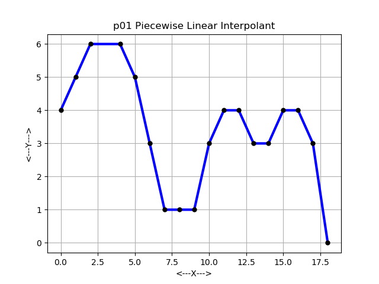 | 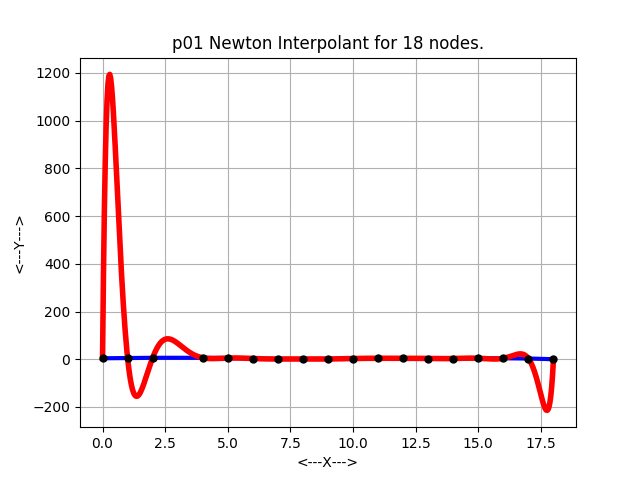 |
| 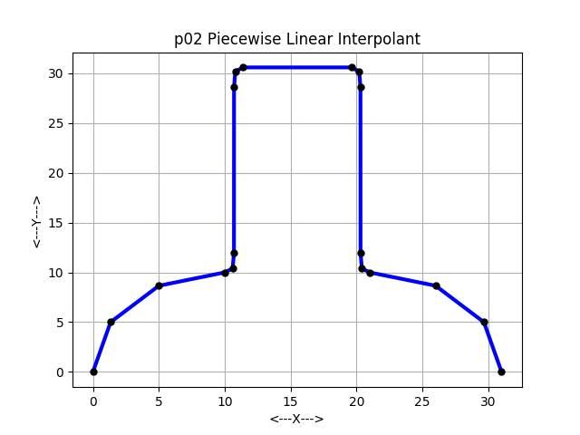 | 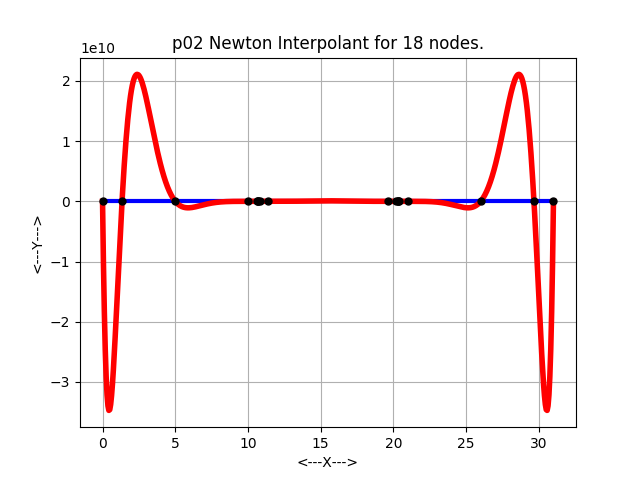 |
| 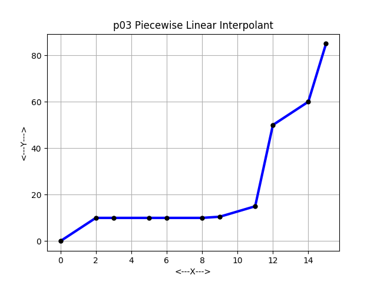 | 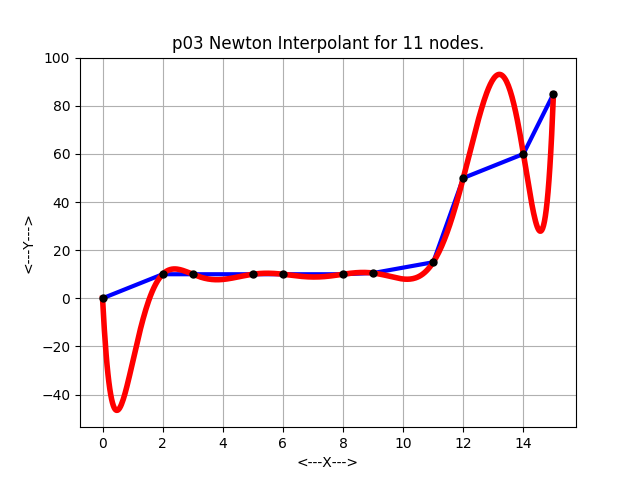 |
| 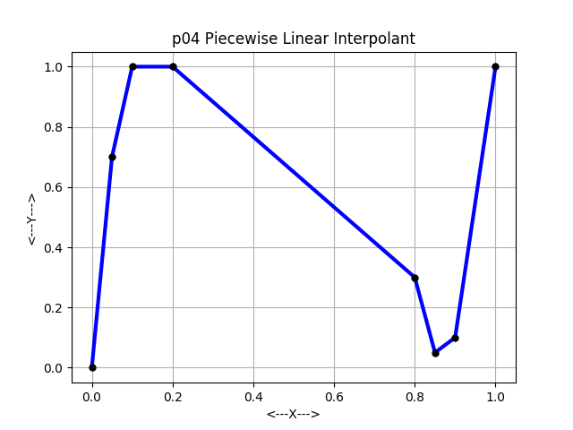 | 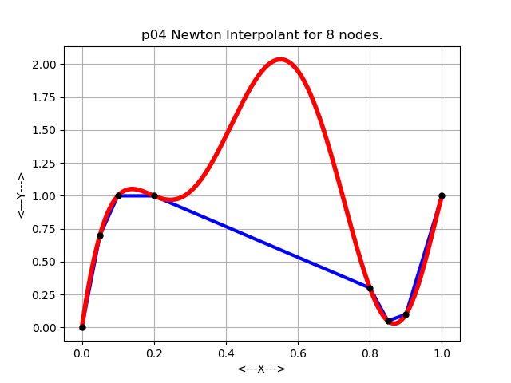 |
| 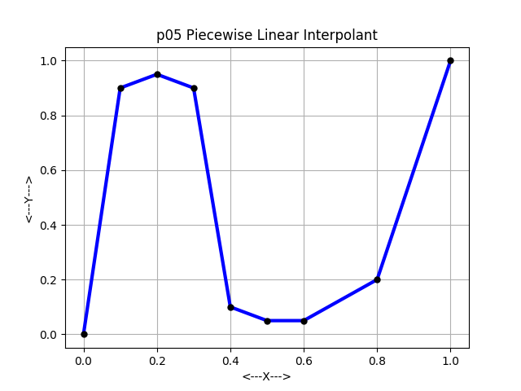 | 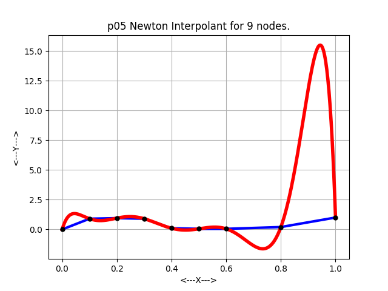 |
| 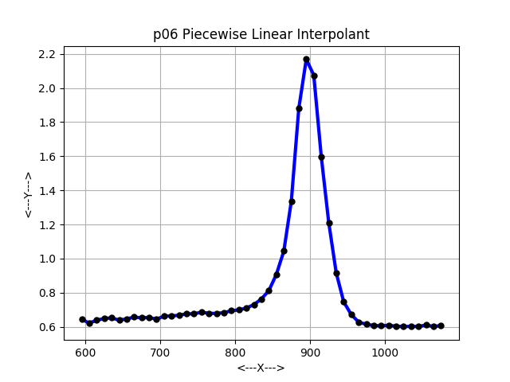 | 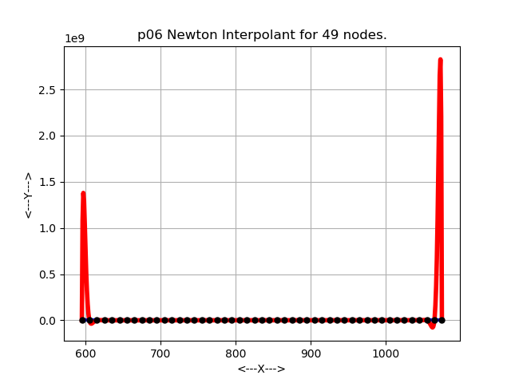 |
| 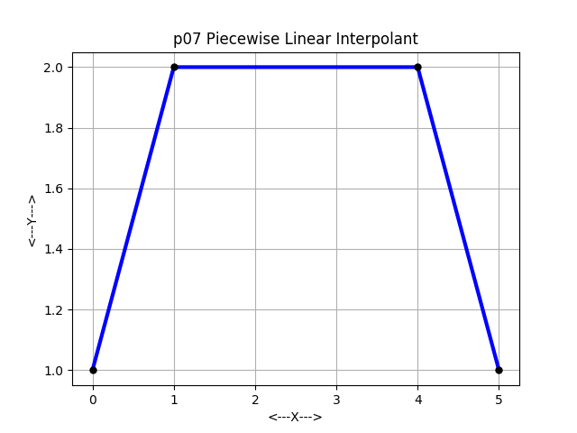 | 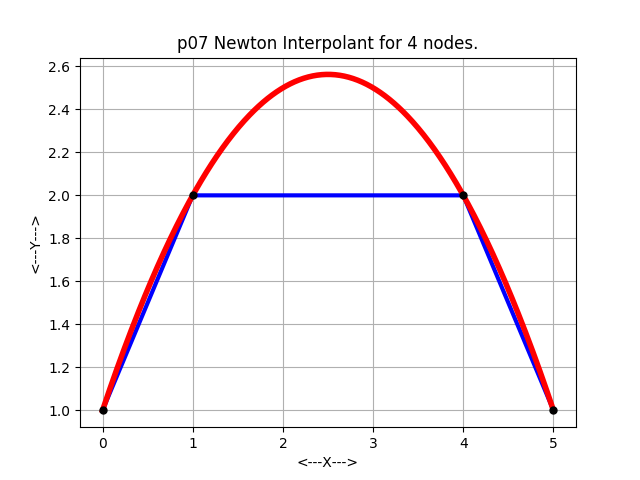 |
|  | 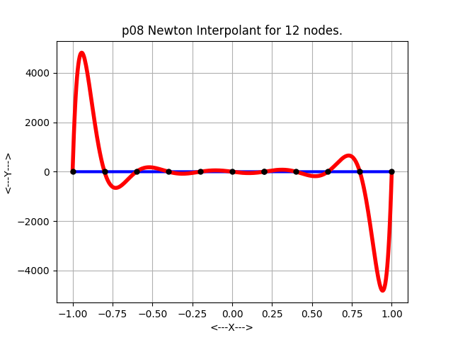 |

## nearest_interp_1d

| data                  | interp                 |
| --------------------- | ---------------------- |
| 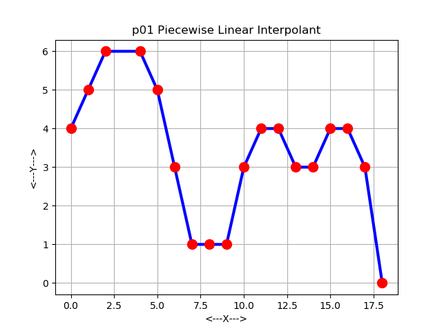 | 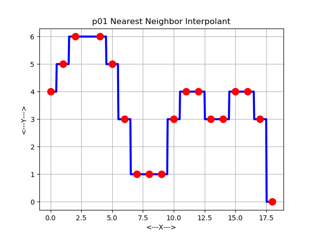 |
| 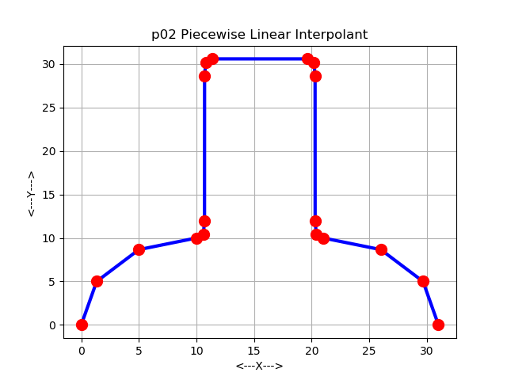 | 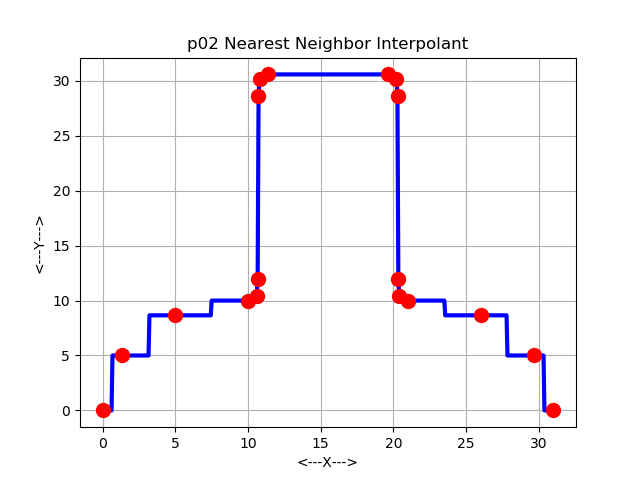 |
| 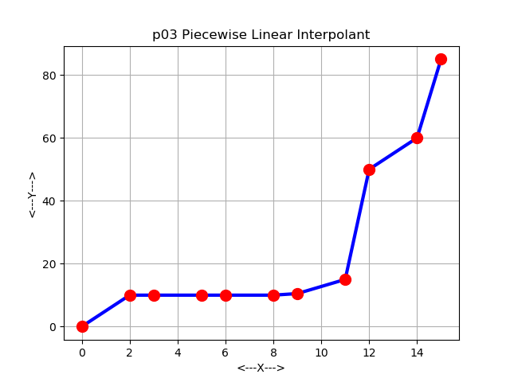 | 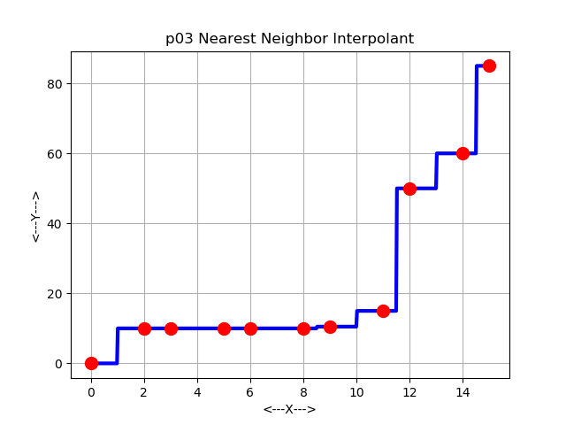 |
| 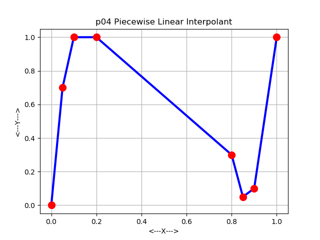 | 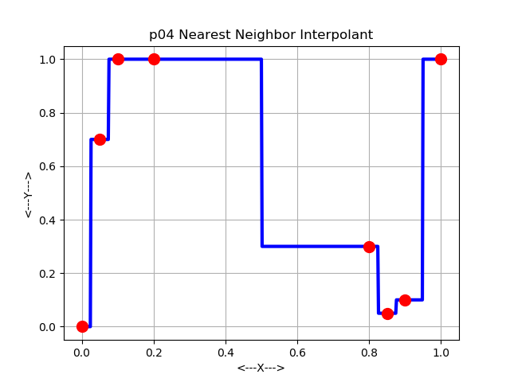 |
| 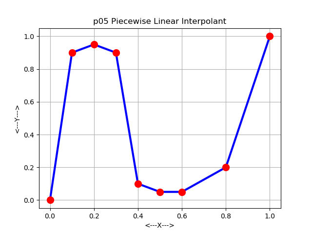 | 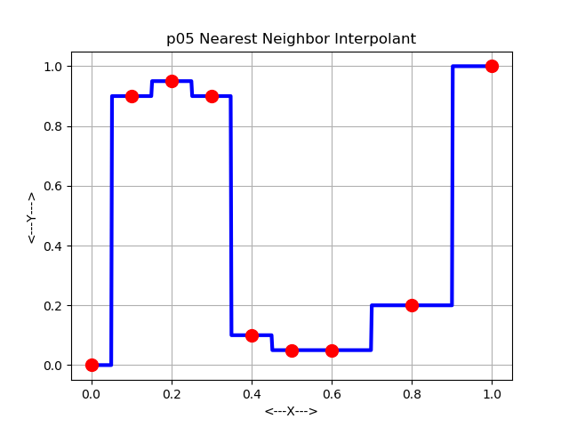 |
|  | 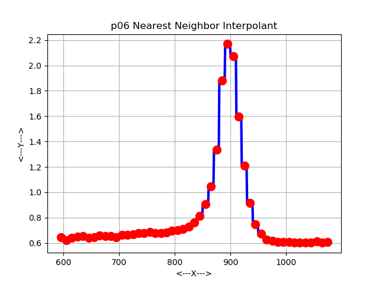 |
| 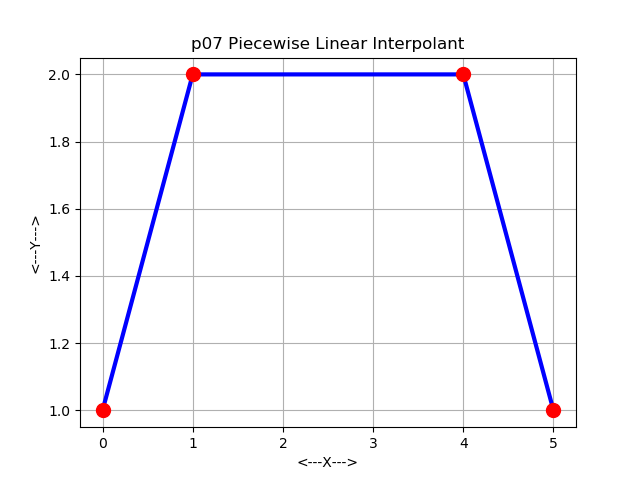 | 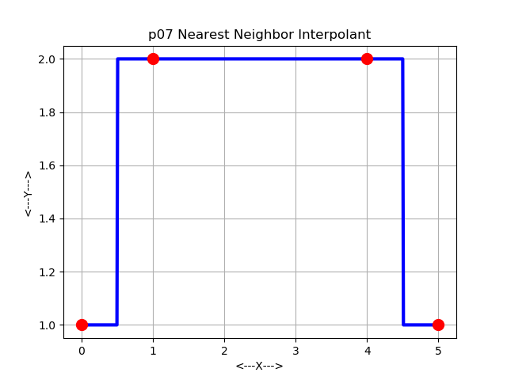 |
| 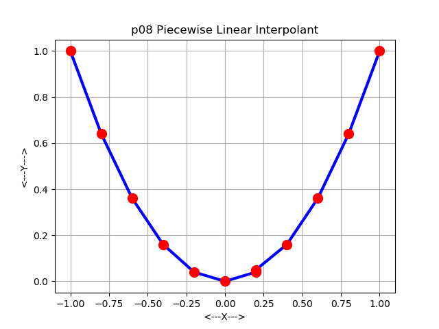 | 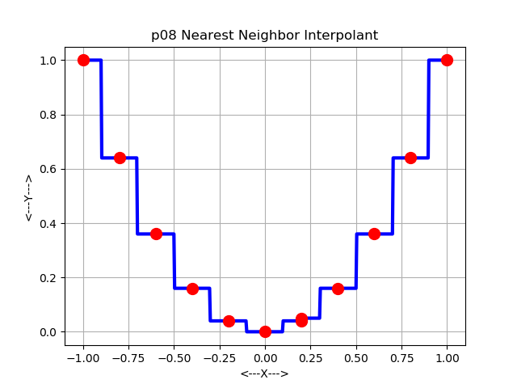 |
