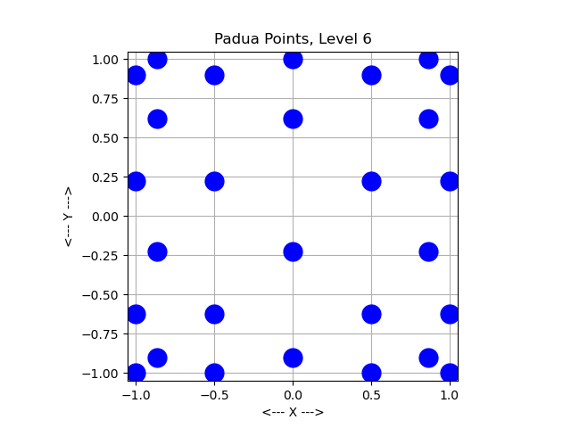

# padua

2D Points for Interpolation or Integration  
2D Padua points,  
as well as interpolation weights or quadrature weights  

| 00                     | 01                     | 02                     |
| ---------------------- | ---------------------- | ---------------------- |
|  |  |  |
|  |  |  |
|  |  |  |
|  |  |
