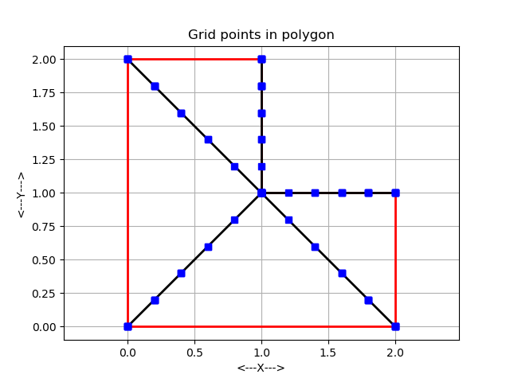
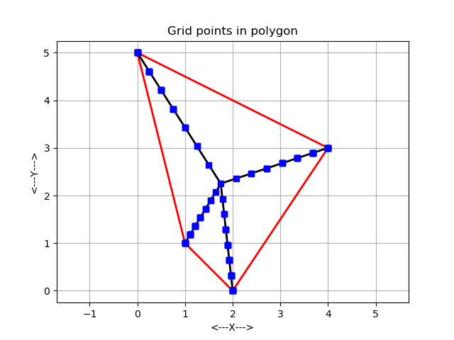
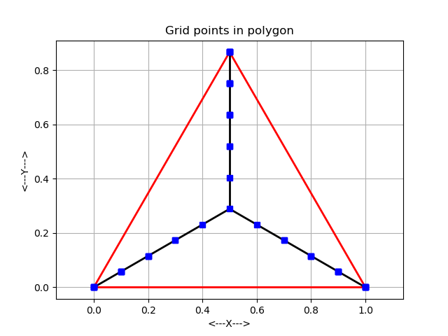
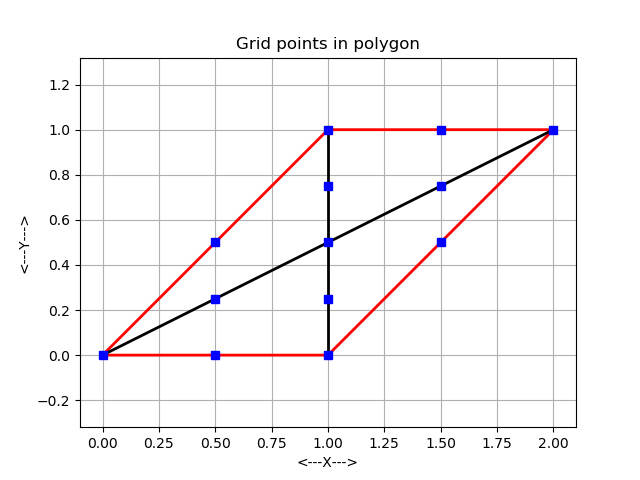

# poylygon_grid

- polygon_grid_count_test
  - counts NG, the number of points in a grid defined with N+1 points on each side of a polygon of NV vertices
- polygon_grid_display_test
- polygon_grid_points_test01
- polygon_grid_points_test02
- polygon_grid_points_test03

| ell               | quad               | tri                    |
| ----------------- | ------------------ | ---------------------- |
|  |  |  |

polygon_display

