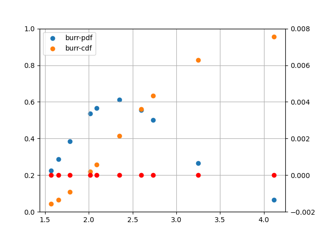
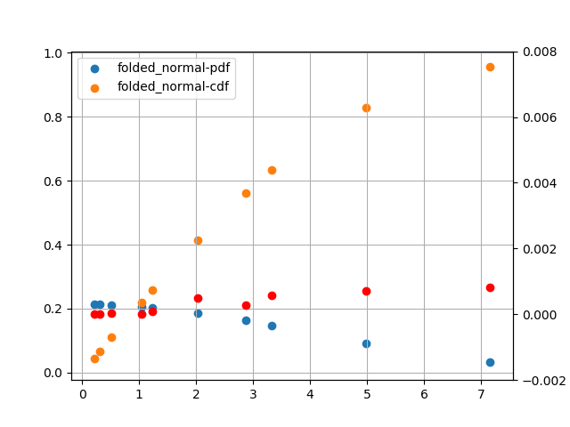

|                      |                           |                         |
| -------------------- | ------------------------- | ----------------------- |
|  |           |     |
|    |            |   |
|    |  |  |

## 1. angle.py

## 2. anglit.py

## 3. arcsin.py

## 4. benford.py

## 5. bernoulli.py

## 6. bessel_i0.py

### 6.1. bessel_i0_values.py

### 6.2. bessel_i1.py

### 6.3. bessel_i1_values.py

## 7. beta.py

### 7.1. beta_binomial.py

### 7.2. beta_cdf_values.py

### 7.3. beta_inc.py

### 7.4. beta_inc_values.py

### 7.5. beta_values.py

## 8. binomial.py

## 9. birthday.py

## 10. bradford.py

## 11. buffon.py

### 11.1. buffon_box.py

## 12. burr.py

## 13. cardioid.py

## 14. cauchy.py

## 15. chebyshev1.py

## 16. chi.py

### 16.1. chi_square.py

### 16.2. chi_square_noncentral.py

## 17. circular_normal.py

### 17.1. circular_normal_01.py

## 18. coupon.py

### 18.1. coupon_complete.py

## 19. deranged.py

## 20. digamma.py

## 21. dipole.py

## 22. dirichlet.py

### 22.1. dirichlet_mix.py

## 23. discrete.py

### 23.1. empirical_discrete.py

## 24. disk.py

## 25. english_letter.py

### 25.1. english_sentence_length.py

### 25.2. english_word_length.py

## 26. erf_values.py

## 27. erlang.py

## 28. exponential.py

### 28.1. exponential_01.py

## 29. extreme_values.py

### 29.1. extreme_values_cdf_values.py

## 30. f.py

## 31. fermi_dirac.py

## 32. fisher.py

## 33. fisk.py

## 34. folded_normal.py

## 35. frechet.py

## 36. gamma.py

### 36.1. gamma_inc_values.py

### 36.2. gamma_log_values.py

### 36.3. gamma_values.py

## 37. genlogistic.py

## 38. geometric.py

## 39. gompertz.py

## 40. gumbel.py

## 41. half_normal.py

## 42. hypergeometric.py

## 43. inverse_gaussian.py

## 44. laplace.py

## 45. levy.py

## 46. logistic.py

### 46.1. log_normal.py

### 46.2. log_series.py

### 46.3. log_uniform.py

## 47. lorentz.py

## 48. maxwell.py

## 49. multinomial.py

### 49.1. multinomial_coef.py

### 49.2. multinoulli.py

## 50. nakagami.py

## 51. negative_binomial.py

## 52. normal.py

### 52.1. normal_01.py

### 52.2. normal_01_cdf_values.py

### 52.3. normal_truncated_a.py

### 52.4. normal_truncated_ab.py

### 52.5. normal_truncated_b.py

## 53. owen_values.py

## 54. pareto.py

## 55. pearson_05.py

## 56. planck.py

## 57. poisson.py

## 58. power.py

## 59. psi_values.py

## 60. quasigeometric.py

## 61. rayleigh.py

## 62. reciprocal.py

## 63. runs.py

## 64. sech.py

## 65. semicircular.py

## 66. sine

### 66.1. sin_power_int.py

### 66.2. sin_power_int_values.py

### 66.3. cosine.py

## 67. stirling2.py

## 68. student.py

## 69. student_noncentral.py

## 70. tfn.py

## 71. triangle.py

## 72. triangular.py

## 73. trigamma.py

## 74. trigamma_values.py

## 75. uniform.py

## 76. uniform_01.py

## 77. uniform_01_order.py

## 78. uniform_discrete.py

## 79. uniform_nsphere.py

## 80. von_mises.py

## 81. weibull.py

## 82. weibull_discrete.py

## 83. zipf.py
