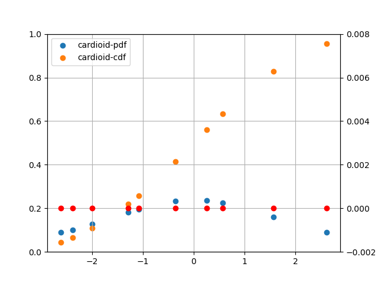
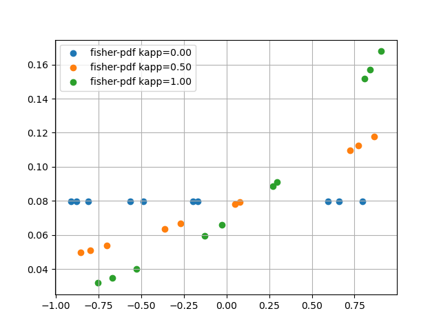

|                      |                           |                         |
| -------------------- | ------------------------- | ----------------------- |
|  |           |     |
|    |            |   |
|    |  |  |

## angle.py

## anglit.py

## arcsin.py

## benford.py

## bernoulli.py

## bessel_i0.py

## bessel_i0_values.py

## bessel_i1.py

## bessel_i1_values.py

## beta.py

## beta_binomial.py

## beta_cdf_values.py

## beta_inc.py

## beta_inc_values.py

## beta_values.py

## binomial.py

## birthday.py

## bradford.py

## buffon.py

## buffon_box.py

## burr.py

## cardioid.py

## cauchy.py

## chebyshev1.py

## chi.py

## chi_square.py

## chi_square_noncentral.py

## circular_normal.py

## circular_normal_01.py

## cosine.py

## coupon.py

## coupon_complete.py

## deranged.py

## digamma.py

## dipole.py

## dirichlet.py

## dirichlet_mix.py

## discrete.py

## disk.py

## empirical_discrete.py

## english_letter.py

## english_sentence_length.py

## english_word_length.py

## erf_values.py

## erlang.py

## exponential.py

## exponential_01.py

## extreme_values.py

## extreme_values_cdf_values.py

## f.py

## fermi_dirac.py

## fisher.py

## fisk.py

## folded_normal.py

## frechet.py

## gamma.py

## gamma_inc_values.py

## gamma_log_values.py

## gamma_values.py

## genlogistic.py

## geometric.py

## gompertz.py

## gumbel.py

## half_normal.py

## hypergeometric.py

## inverse_gaussian.py

## laplace.py

## levy.py

## logistic.py

## log_normal.py

## log_series.py

## log_uniform.py

## lorentz.py

## maxwell.py

## multinomial.py

## multinomial_coef.py

## multinoulli.py

## nakagami.py

## negative_binomial.py

## normal.py

## normal_01.py

## normal_01_cdf_values.py

## normal_truncated_a.py

## normal_truncated_ab.py

## normal_truncated_b.py

## owen_values.py

## pareto.py

## pearson_05.py

## planck.py

## plot.py

## poisson.py

## power.py

## prob_test.py

## psi_values.py

## quasigeometric.py

## r8_gamma_inc.py

## rayleigh.py

## reciprocal.py

## runs.py

## sech.py

## semicircular.py

## sin_power_int.py

## sin_power_int_values.py

## stirling2.py

## student.py

## student_noncentral.py

## tfn.py

## triangle.py

## triangular.py

## trigamma.py

## trigamma_values.py

## uniform.py

## uniform_01.py

## uniform_01_order.py

## uniform_discrete.py

## uniform_nsphere.py

## von_mises.py

## weibull.py

## weibull_discrete.py

## zipf.py
