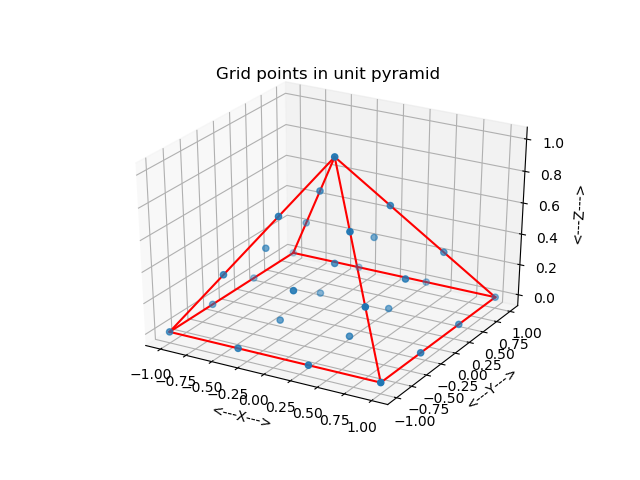
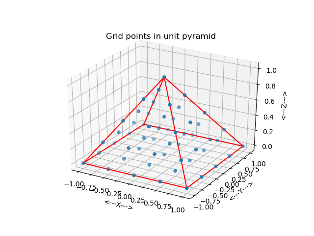
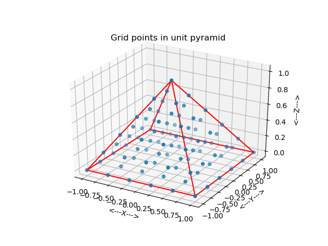
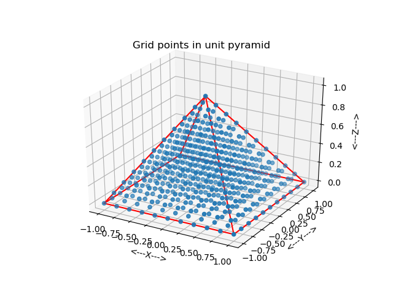

# pyramid_grid

| pic1                                | pic2                               |
| ----------------------------------- | ---------------------------------- |
|  |  |

n=3
| num  | pic                                   |
| ---- | ------------------------------------- |
| n=3  |  |
| n=4  |  |
| n=5  |  |
| n=10 |  |
